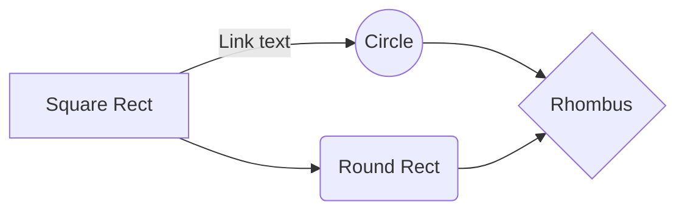

* content
{:toc}

```mermaid
graph LR
    A[Square Rect] -- Link text --> B((Circle))
    A --> C(Round Rect)
    B --> D{Rhombus}
    C --> D
```

\begin{equation}
h_\theta(x) = \theta^Tx = \theta_0x_0 + \theta_1x_1 + \cdots  + \theta_nx_n
\end{equation}

